<section class="sheet cover" id="cover">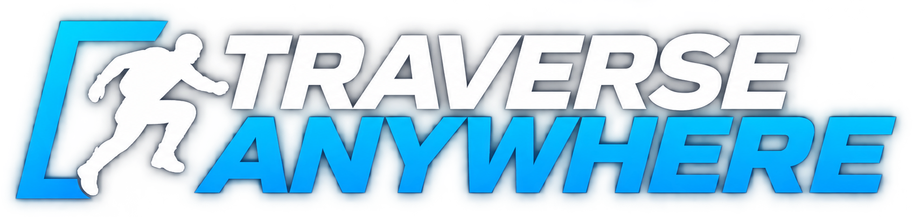<h1>THE USER GUIDE</h1>
<strong>FEATURES AND SETUP FOR YOUR PROJECT</strong>
Make the world traversable. Keep your workflow simple.
<ol><li>Explore the features</li><li>Install and prepare your pawn</li><li>Import animations safely</li><li>Make objects traversable</li><li>Test and troubleshoot</li></ol>

UNREAL ENGINE 5.8 / EXECUTE GAMES / OCTOBER 2026 CHARACTERS / ANIMATIONS / TRAVERSABLE OBJECTS
</section>

<section class="sheet" id="start-here" aria-label="Start here"><h2>Start here</h2>
{{ chapter | markdownify }}

EXECUTE GAMES / TRAVERSE ANYWHERE / USER GUIDE2
</section>

<section class="sheet" id="features" aria-label="Features"><h2>Features</h2>
{{ chapter | markdownify }}

EXECUTE GAMES / TRAVERSE ANYWHERE / USER GUIDE3
</section>

<section class="sheet" id="features-character-setup" aria-label="Features character setup"><h2>Features character setup</h2>
<figure>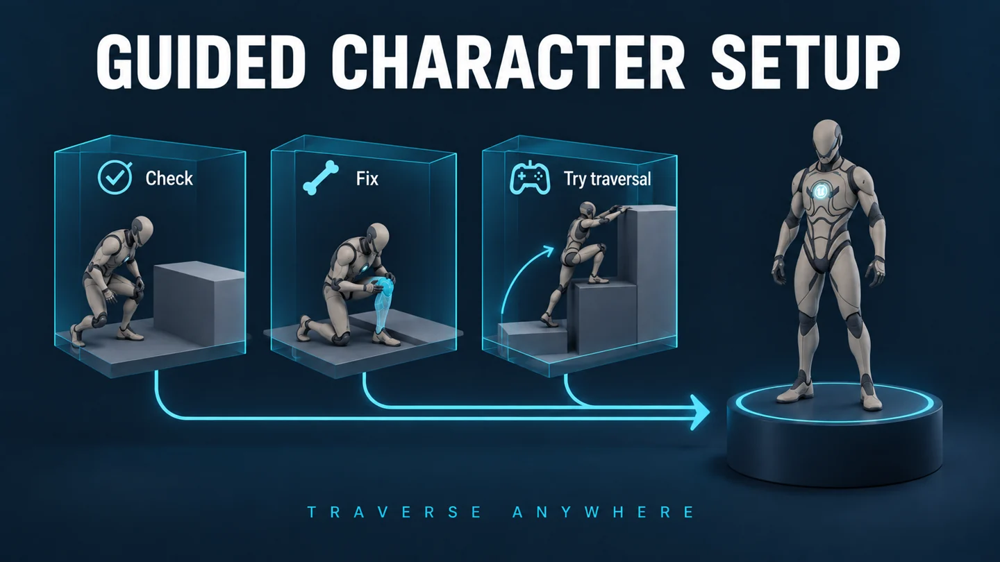<figcaption><strong>Guided character setup.</strong> See what is ready, fix supported setup rows individually or use Fix all. Backup reminders and confirmations identify shared changes; optional rows stay yours to choose.</figcaption></figure>
<figure>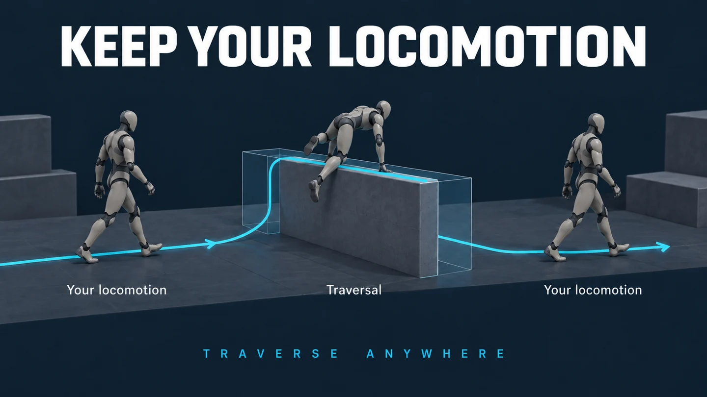<figcaption><strong>Traversal with your locomotion.</strong> Add traversal through a montage slot while keeping your character&#x27;s normal locomotion. Supported jump setup tries traversal first and falls back to ordinary jump when no action can start.</figcaption></figure>

EXECUTE GAMES / TRAVERSE ANYWHERE / USER GUIDE4
</section>

<section class="sheet" id="features-animation-libraries" aria-label="Features animation libraries"><h2>Features animation libraries</h2>
<figure>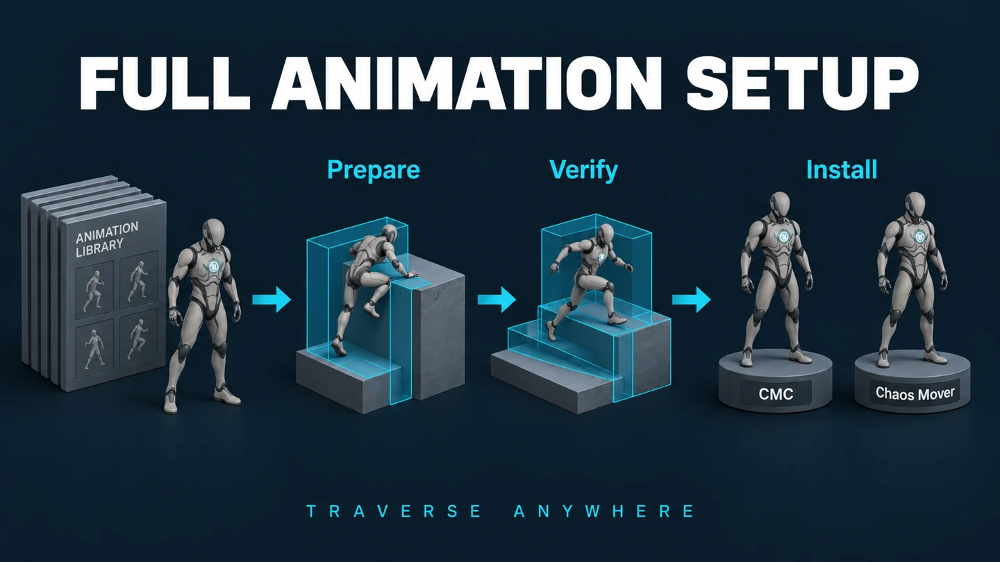<figcaption><strong>Full animation preparation.</strong> Prepare and verify a motion-matching library for your selected mesh, then install a generated CMC or Chaos Mover pawn, game mode and settings. Existing gameplay pawns are kept separate.</figcaption></figure>
<figure>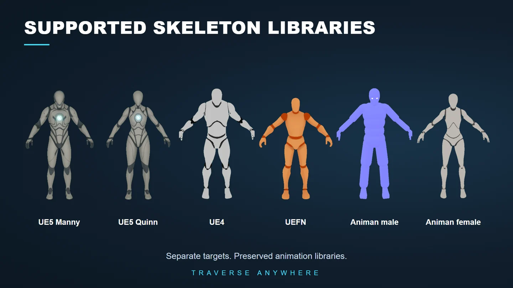<figcaption><strong>Supported skeleton libraries.</strong> Import baked traversal clips for Manny, Quinn, UE4, UEFN and male or female Animan. Multiple skeletons and differing mesh poses retain their own libraries without overwriting other targets.</figcaption></figure>

EXECUTE GAMES / TRAVERSE ANYWHERE / USER GUIDE5
</section>

<section class="sheet" id="features-styles-and-action-selection" aria-label="Features styles and action selection"><h2>Features styles and action selection</h2>
<figure>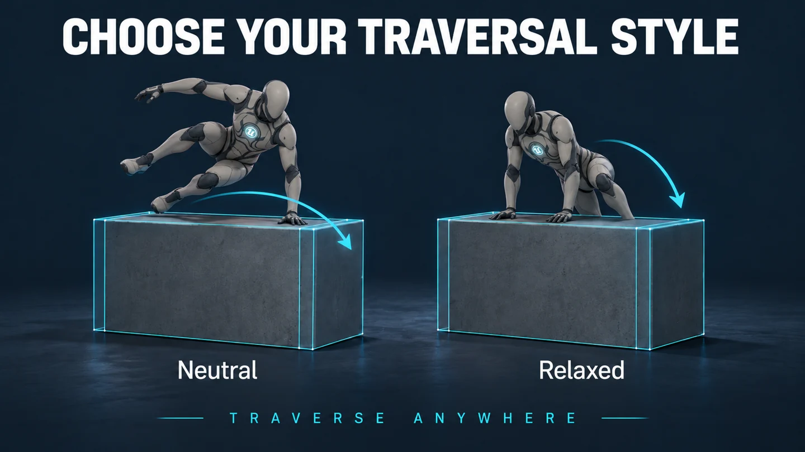<figcaption><strong>Neutral and Relaxed styles.</strong> Choose Neutral or Relaxed traversal, then apply the chooser setup. Your selection is retained; some Relaxed actions intentionally reuse Neutral clips.</figcaption></figure>
<figure>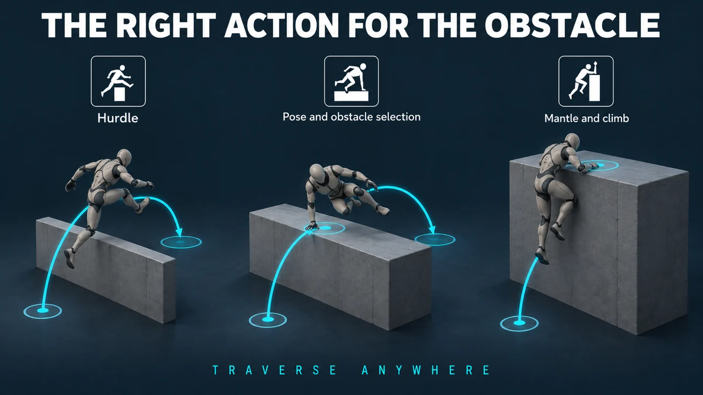<figcaption><strong>Pose selection and motion warping.</strong> A chooser uses approach, obstacle data and pose history to select hurdles, vaults, mantles and climbs. Motion warping adjusts supported clips to ledge and landing targets; grounded climb rows extend to 300 cm.</figcaption></figure>

EXECUTE GAMES / TRAVERSE ANYWHERE / USER GUIDE6
</section>

<section class="sheet" id="features-contact-and-locomotion-recovery" aria-label="Features contact and locomotion recovery"><h2>Features contact and locomotion recovery</h2>
<figure>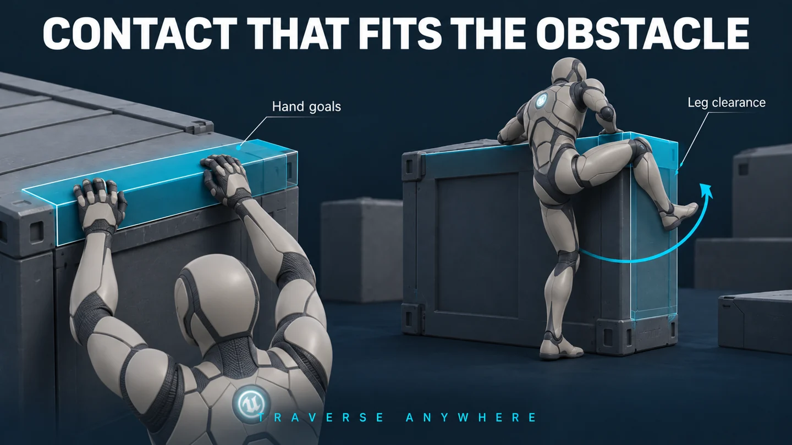<figcaption><strong>Hand contact and leg clearance.</strong> Baked retargeting preserves authored hand-goal heights on supported rigs. Foot-clearance controls help keep legs clear of box collision, while setup gates ordinary foot IK and unwanted airborne poses during traversal.</figcaption></figure>
<figure>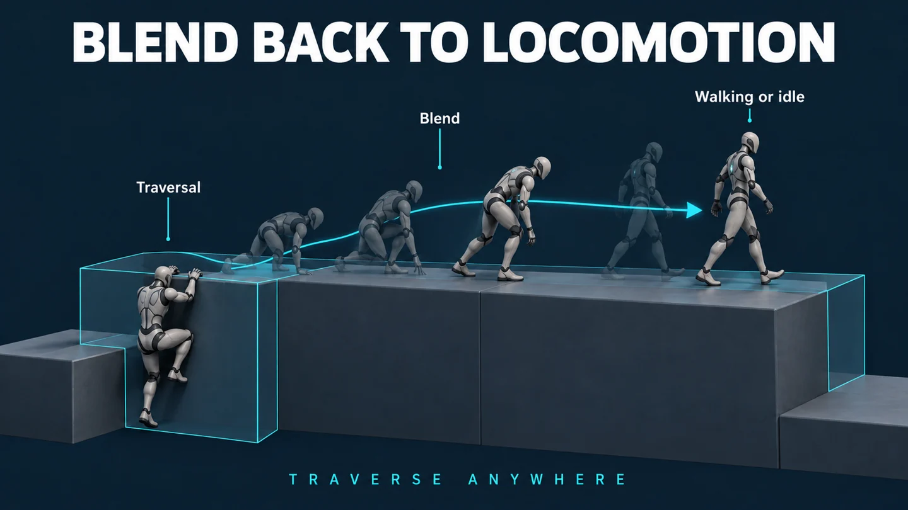<figcaption><strong>Return to locomotion.</strong> Traversal uses the montage&#x27;s blend-out to recover into walking or idle, including hybrid setups. Keep the slot connected to locomotion; custom code must preserve the animation graph through the handoff.</figcaption></figure>

EXECUTE GAMES / TRAVERSE ANYWHERE / USER GUIDE7
</section>

<section class="sheet" id="features-objects-and-proxies-1" aria-label="Features objects and proxies 1"><h2>Features objects and proxies 1</h2>
<figure>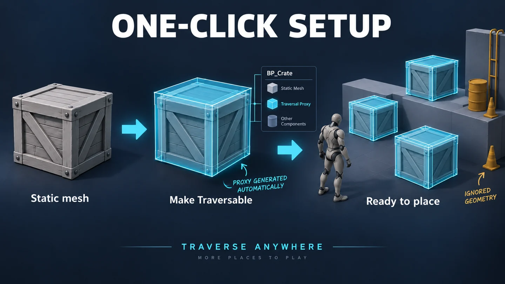<figcaption><strong>One click object setup.</strong> Right-click a static mesh and choose Make Traversable. The new Blueprint includes its mesh, Traversable component, generated proxies and fitted Pawn collision, ready to drag into your level.</figcaption></figure>
<figure>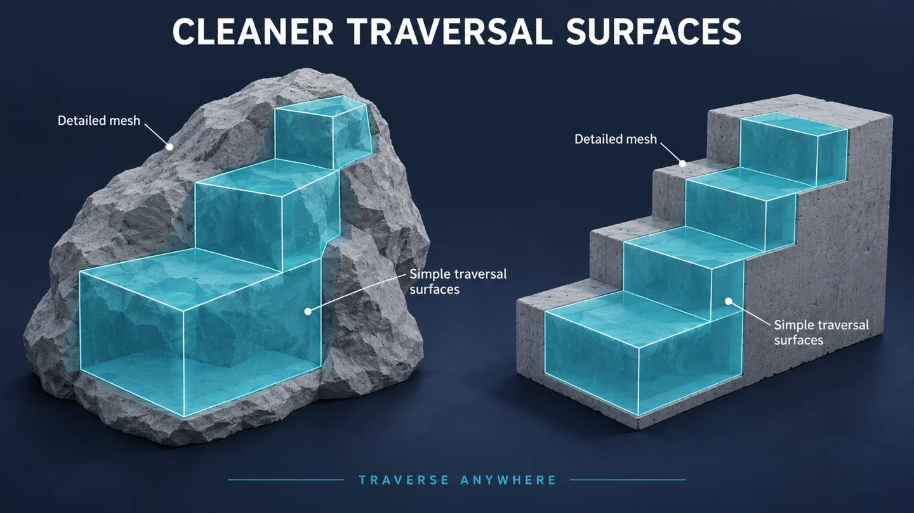<figcaption><strong>Cleaner traversal surfaces.</strong> Fit simple boxes to detailed static meshes and supported assemblies, including instanced, spline and child-actor meshes. Traversal reads the fitted surfaces rather than relying on poor source collision.</figcaption></figure>

EXECUTE GAMES / TRAVERSE ANYWHERE / USER GUIDE8
</section>

<section class="sheet" id="features-objects-and-proxies-2" aria-label="Features objects and proxies 2"><h2>Features objects and proxies 2</h2>
<figure>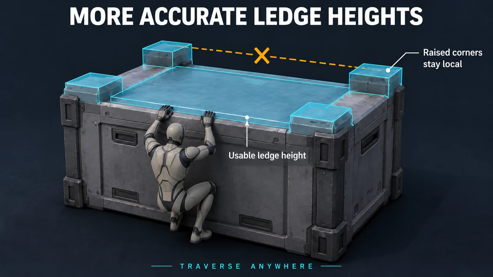<figcaption><strong>Local ledge heights.</strong> Raised corners stay local instead of lifting the entire top. Tighter edge fitting gives the traversal chooser and motion warping more representative ledge targets.</figcaption></figure>
<figure>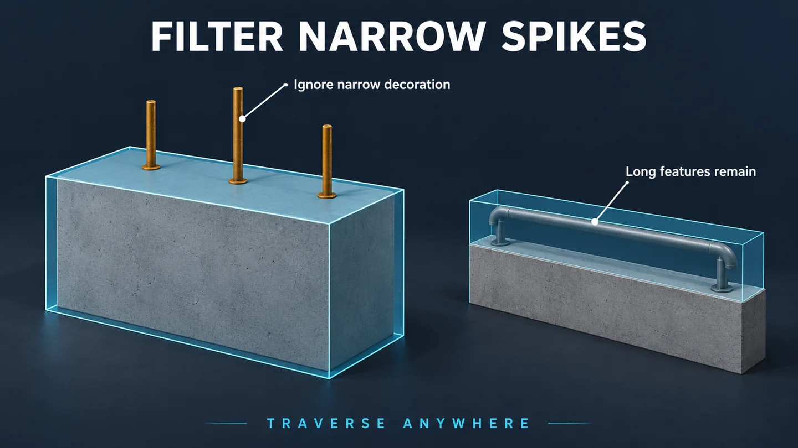<figcaption><strong>Narrow spike filtering.</strong> Filter small isolated raised details without flattening long walls or rails. The filter radius is adjustable, so you can retain decoration when it matters to your design.</figcaption></figure>

EXECUTE GAMES / TRAVERSE ANYWHERE / USER GUIDE9
</section>

<section class="sheet" id="features-objects-and-proxies-3" aria-label="Features objects and proxies 3"><h2>Features objects and proxies 3</h2>
<figure>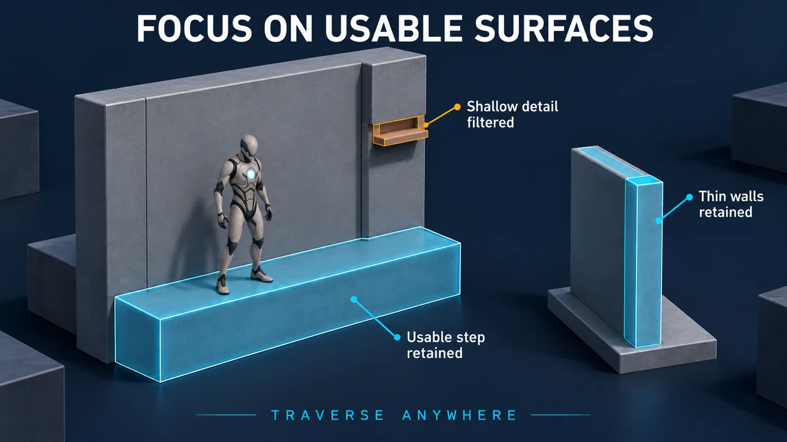<figcaption><strong>Usable surface filtering.</strong> Omit shallow shelves beside taller geometry while retaining usable steps and standalone thin walls. Configure the required footprint; runtime room checks still decide whether the action is safe.</figcaption></figure>
<figure>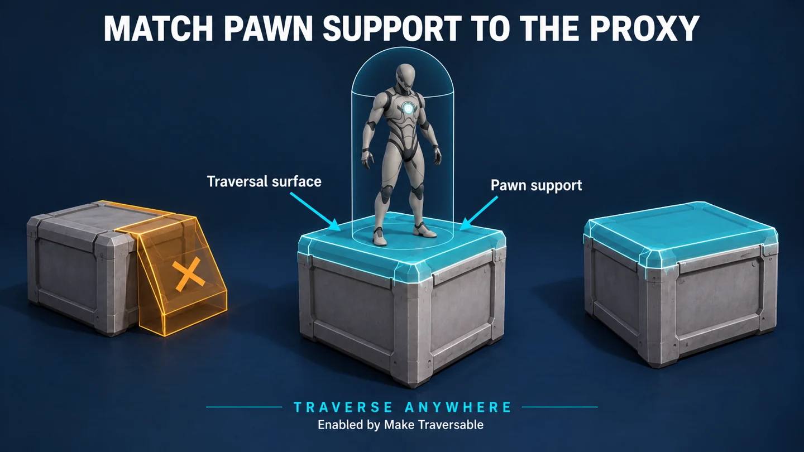<figcaption><strong>Fitted Pawn support.</strong> Optional physical proxies align Pawn support with the traversal shape. Make Traversable enables them automatically, replacing the source mesh&#x27;s Pawn response while leaving its other responses available.</figcaption></figure>

EXECUTE GAMES / TRAVERSE ANYWHERE / USER GUIDE10
</section>

<section class="sheet" id="features-objects-and-proxies-4" aria-label="Features objects and proxies 4"><h2>Features objects and proxies 4</h2>
<figure>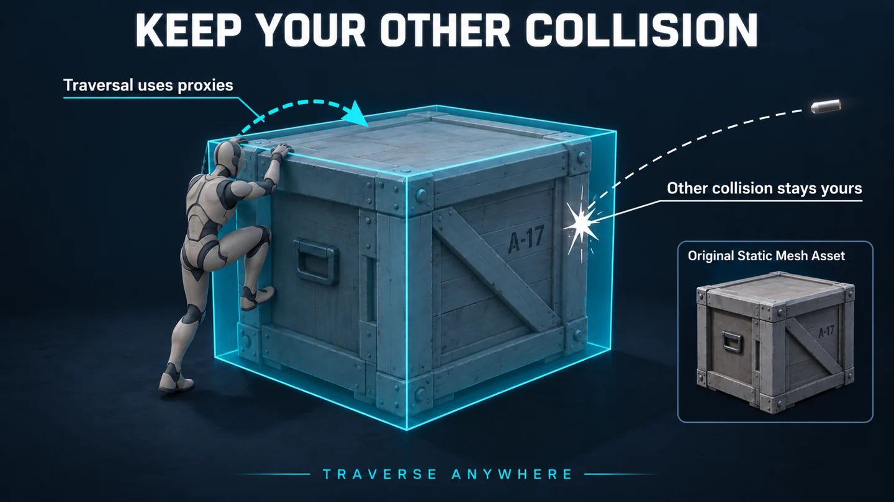<figcaption><strong>Preserved source geometry.</strong> Keep the original static mesh asset, visual detail and non-Pawn collision responses. Traversal probes and the forward sweep use eligible generated proxies, avoiding competing source colliders.</figcaption></figure>
<figure>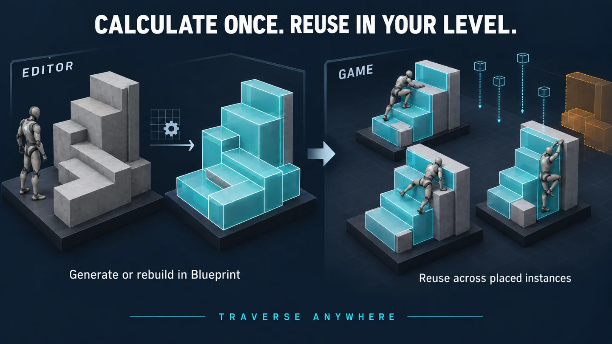<figcaption><strong>Reusable runtime proxies.</strong> Calculate in the editor and reuse the saved components across Blueprint instances and packaged games. The game queries boxes without running the editor fitter; cost depends on the proxy count.</figcaption></figure>

EXECUTE GAMES / TRAVERSE ANYWHERE / USER GUIDE11
</section>

<section class="sheet" id="features-objects-and-proxies-5" aria-label="Features objects and proxies 5"><h2>Features objects and proxies 5</h2>
<figure>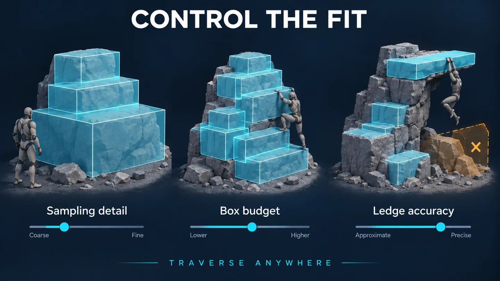<figcaption><strong>Control over fitting.</strong> Adjust sampling, filters, top and ledge tolerances, and the preferred box budget. Accuracy limits take priority over the budget, so complexity reductions do not justify an arbitrarily inflated surface.</figcaption></figure>
<figure>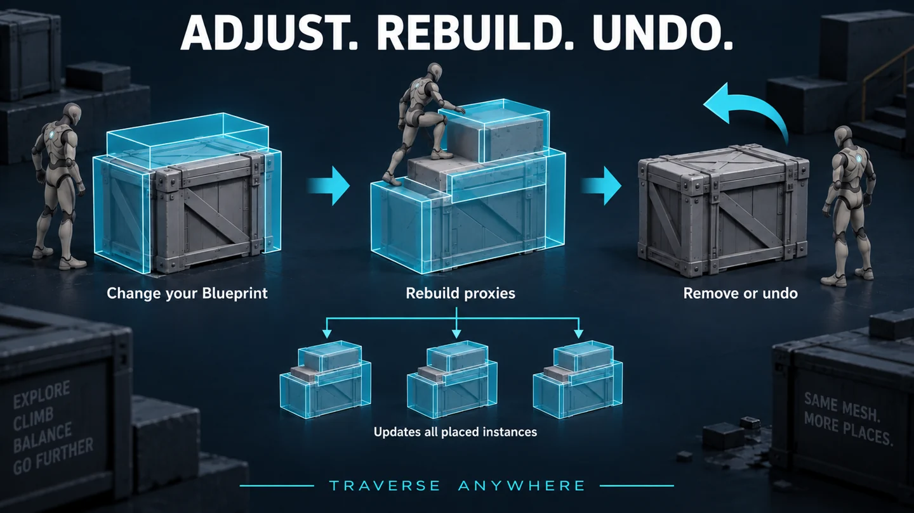<figcaption><strong>Rebuild remove and undo.</strong> Rebuild the Blueprint&#x27;s proxies after geometry or setting changes to update its instances. Generation is undoable; removing proxies restores source tracing and ends the fitted Pawn collision takeover.</figcaption></figure>

EXECUTE GAMES / TRAVERSE ANYWHERE / USER GUIDE12
</section>

<section class="sheet" id="features-movement-and-multiplayer" aria-label="Features movement and multiplayer"><h2>Features movement and multiplayer</h2>
<figure>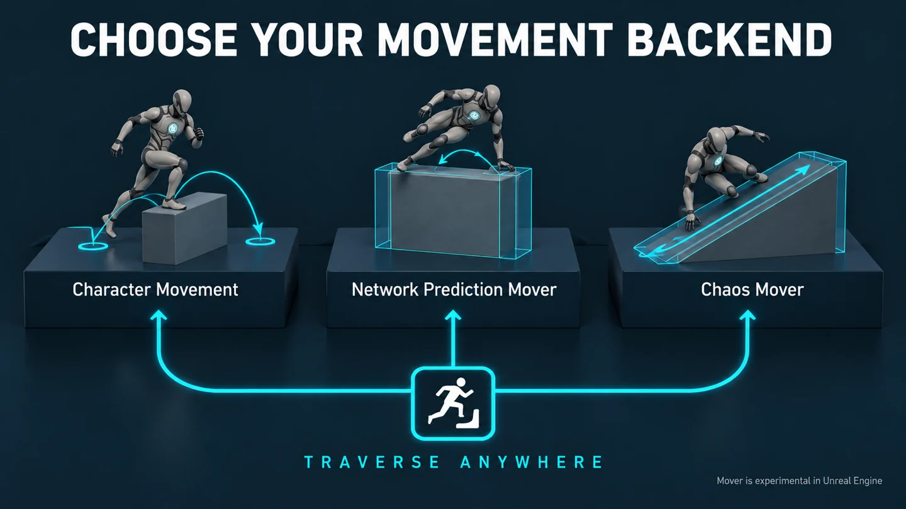<figcaption><strong>Movement backend support.</strong> Use traversal with Character Movement, Network Prediction Mover or Chaos Mover. Relevant setup rows guide the backend requirements. Full animation setup offers CMC or Chaos Mover; Mover remains experimental in Unreal.</figcaption></figure>
<figure>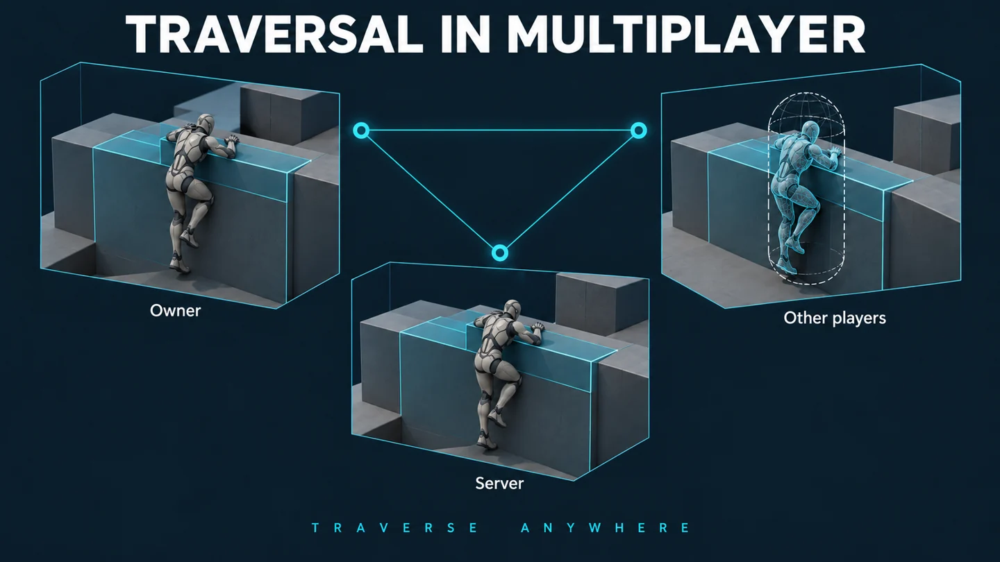<figcaption><strong>Multiplayer traversal playback.</strong> Supported backends coordinate traversal across owner, server and other players. Chaos remote-mesh replay improves displayed traversal recovery while gameplay collision remains on the capsule. Test your own network conditions.</figcaption></figure>

EXECUTE GAMES / TRAVERSE ANYWHERE / USER GUIDE13
</section>

<section class="sheet" id="features-inspection-and-integration" aria-label="Features inspection and integration"><h2>Features inspection and integration</h2>
<figure>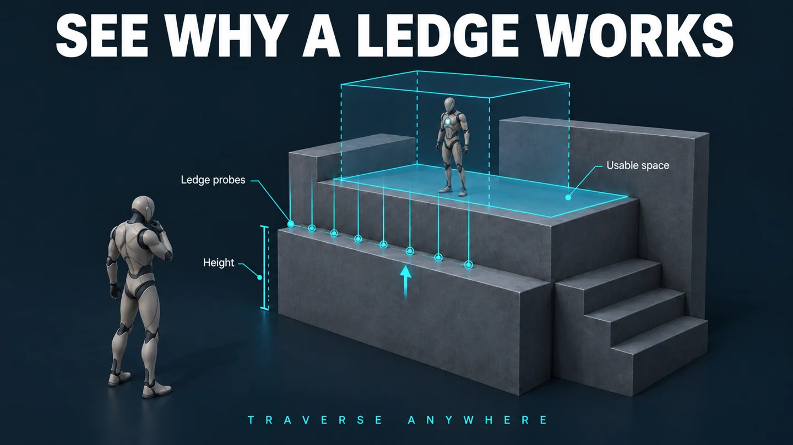<figcaption><strong>Ledge inspection and controls.</strong> Inspect estimated height labels and debug probes, then tune ledge width, search height, depth, surface inset and slope acceptance. Queries follow current object transforms and usable room still matters.</figcaption></figure>
<figure>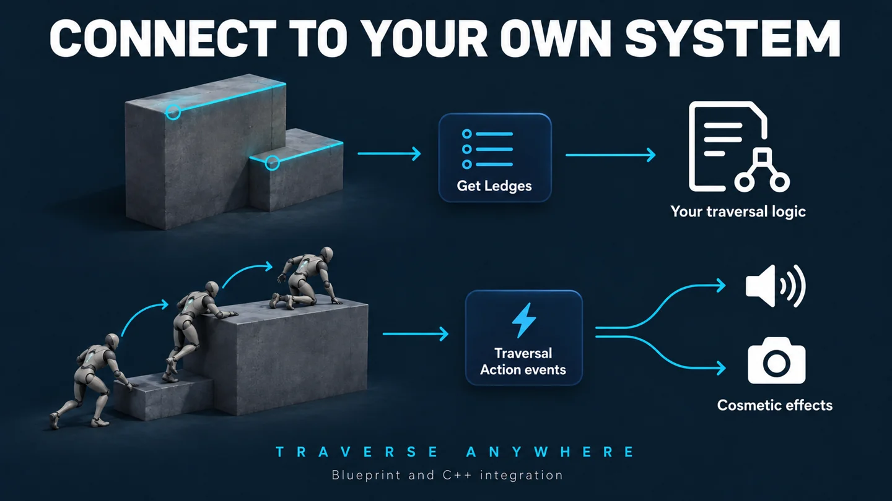<figcaption><strong>Custom integration and events.</strong> Read front and back ledge data through Blueprint or C++ for your own traversal logic. Start and end events support cosmetics; animation helper nodes expose traversal state without replacing your usual values.</figcaption></figure>

EXECUTE GAMES / TRAVERSE ANYWHERE / USER GUIDE14
</section>

<section class="sheet" id="set-up-an-existing-character" aria-label="Set up an existing character"><h2>Set up an existing character</h2>
{{ chapter | markdownify }}

EXECUTE GAMES / TRAVERSE ANYWHERE / USER GUIDE15
</section>

<section class="sheet" id="understand-the-character-setup-rows" aria-label="Understand the character setup rows"><h2>Understand the character setup rows</h2>
{{ chapter | markdownify }}

EXECUTE GAMES / TRAVERSE ANYWHERE / USER GUIDE16
</section>

<section class="sheet" id="choose-and-manage-your-traversal-animations" aria-label="Choose and manage your traversal animations"><h2>Choose and manage your traversal animations</h2>
{{ chapter | markdownify }}

EXECUTE GAMES / TRAVERSE ANYWHERE / USER GUIDE17
</section>

<section class="sheet" id="create-a-character-with-full-animations" aria-label="Create a character with full animations"><h2>Create a character with full animations</h2>
{{ chapter | markdownify }}

EXECUTE GAMES / TRAVERSE ANYWHERE / USER GUIDE18
</section>

<section class="sheet" id="make-an-object-traversable" aria-label="Make an object traversable"><h2>Make an object traversable</h2>
{{ chapter | markdownify }}

EXECUTE GAMES / TRAVERSE ANYWHERE / USER GUIDE19
</section>

<section class="sheet" id="adjust-proxies-and-ledges" aria-label="Adjust proxies and ledges"><h2>Adjust proxies and ledges</h2>
{{ chapter | markdownify }}

EXECUTE GAMES / TRAVERSE ANYWHERE / USER GUIDE20
</section>

<section class="sheet" id="use-mover" aria-label="Use Mover"><h2>Use Mover</h2>
{{ chapter | markdownify }}

EXECUTE GAMES / TRAVERSE ANYWHERE / USER GUIDE21
</section>

<section class="sheet" id="test-and-troubleshoot" aria-label="Test and troubleshoot"><h2>Test and troubleshoot</h2>
{{ chapter | markdownify }}

EXECUTE GAMES / TRAVERSE ANYWHERE / USER GUIDE22
</section>
